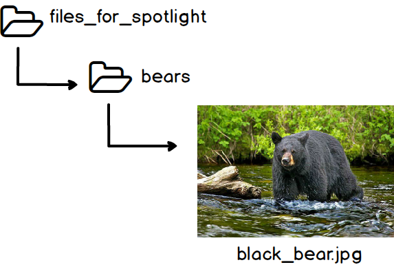
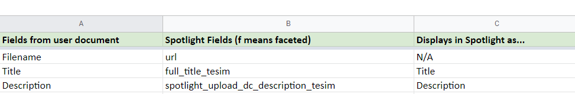
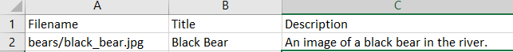

# For Batch Uploading Exhibit Items to Spotlight

### List of Ingredients
1. *User document*: A spreadsheet with metadata fields that you, the user, has chosen
2. *Crosswalking document*: A spreadsheet that lists your user document metadata fields and the corresponding fields in Spotlight
3. A folder on Q:Drive (preferably in the LSYS or Digitization folder) with all the actual objects (images, videos, pdfs, etc.)

### Notes on File Naming and Commas

For the spotlight field "url", the corresponding field in the user document is always the unique file name if all items are in 1 top-level folder. We'll call this field (in the user document) "filename." If your folder has subfolders, then it would be any subfolder names joined with "/" and the filename at the end.

You can name the files anything you want, so long as they are completely unambiguous and follow the note below. (The same filename in different folders is OK.) The filename won't display on Spotlight.

**Note:** Replace any spaces in your folder names with underscores ( \_ ) or hyphens ( - ) and include the extension in the filename.

For example, assume I have a nested folder structure like this (`[]` means a folder and black_bear.jpg is the file):

The path would be bears/black_bear.jpg

In my crosswalking document, I would have

And in the user document, I would have

Imagine I am an ant living in the top most folder (files_for_spotlight). How would you tell me to find black_bear.jpg? You would say something like "go into the bears folder and get the file named black_bear.jpg." This is what we're telling Spotlight to do.

### Export the User Document as a CSV

1. Go to **File > Save As > CSV (Comma delimited) (\*.csv)**

2. Attach the CSV to an email or upload it onto Q:Drive with the rest of your files.

  ***Important!*** If you close the CSV file and then realize you needed to fix something, **do not re-open the CSV in Excel**. Re-opening the CSV can cause Excel to mix up the date formatting and/or non-English characters. Instead, please edit the .xslx file and overwrite or save to a new CSV file.

### Copy/Upload Items to Q:Drive

Copy the entire top-level folder into the Q:Drive (preferably in the LSYS or Digitization folder). You're done!
